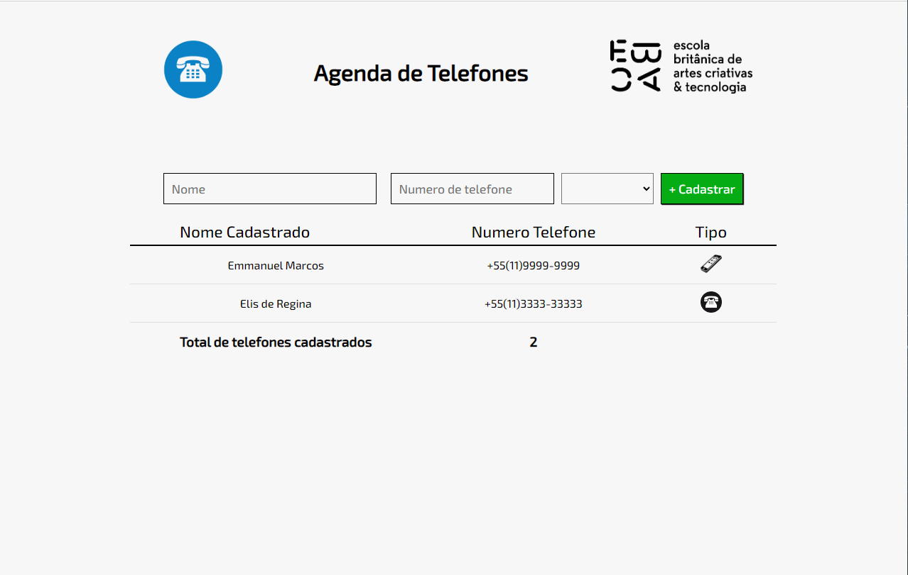

[Descrição](#descrição) |
[Funcionalidades](#funcionalidades) |
[Screenshot ou Gif](#screenshots-ou-gif) |
[Demostração](n#demonstração) |
[Deploy](#deploy) |
[Aprendizados](#aprendizados) |
[Referencias](#referência) |

# Projeto - Agenda de telefone da EBAC

## Descrição:

| Nome | Descrição              |
| ---- | ---------------------- |
|Agenda de Telefones|O **intuito** desse projeto foi **criar uma pagina para agenda de telefones** fazendo o uso da **linguagem JavaScript** para **adição e calculado de total de numeros de telefone**.|

## Funcionalidades

- Uma página HTML  que se assemelhe a uma agenda de telefones. 

## Screenshots ou gif



## Demonstração

Clique no link para acessar. <br>
[Agenda de Telefones ](https://agenda-telefone-theta.vercel.app/)

## Deploy

Para fazer o deploy desse projeto rode

```bash
 https://agenda-telefone-theta.vercel.app/
```

## Aprendizados

- Trabalhando com Formulários.
- Trabalhando com Tabelas.
- Uso da linguagem JavaScript para input de dados em formulários e tabela.

## Referência de estudos

- [EBAC](https://ebaconline.com.br/) 